# flex布局详解
Flexbox（弹性盒模型）是一种CSS布局方式，提供了一种更加有效的方式来对容器中的项目进行布局、对齐和分配空间。相比传统的布局方法（如浮动和定位），Flexbox更容易处理容器内元素的布局，尤其是当元素尺寸未知或动态变化时。

## 1. 基本概念

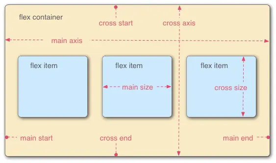

在 flex 容器中默认存在两条轴，**水平主轴(main axis) 和垂直的交叉轴(cross axis)**，这是默认的设置，当然你可以通过修改使垂直方向变为主轴，水平方向变为交叉轴。

在容器中的每个单元块被称之为 **flex item**，每个项目占据的主轴空间为 (main size), 占据的交叉轴的空间为 (cross size)。

容器默认存在两根轴：水平的主轴（main axis）和垂直的交叉轴（cross axis）。主轴的开始位置（与边框的交叉点）叫做main start，结束位置叫做main end；交叉轴的开始位置叫做cross start，结束位置叫做cross end。

## 2. flex 容器

### 2.1.  开启flex布局

元素写了这个属性之后，就变成了一个flex的容器，就可以通过flex布局相关的方式去操作排列子元素。

```css
.container {
    display: flex;
}
```

### 2.2. flex-direction: 决定主轴的方向

```css
.container {
    flex-direction: row | row-reverse | column | column-reverse;
}
```

**默认值：row，主轴为水平方向，起点在左端**
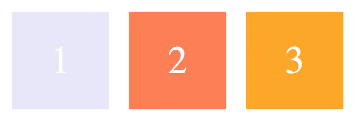

**row-reverse：主轴为水平方向，起点在右端**


**column：主轴为垂直方向，起点在上沿**
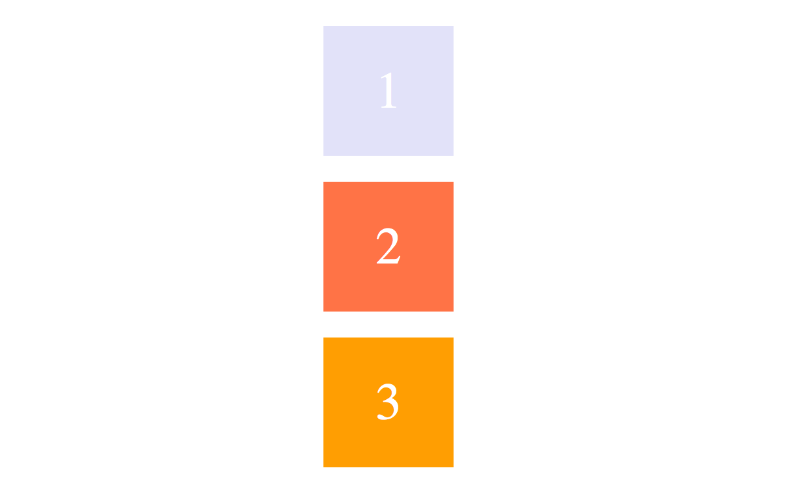

**column-reverse：主轴为垂直方向，起点在下沿**
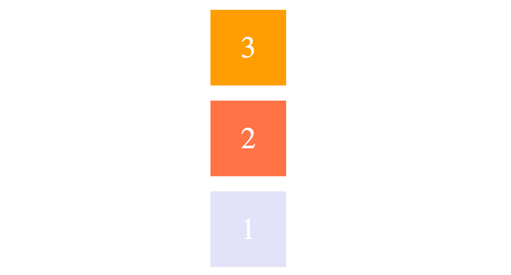

### 2.3. **决定容器内项目是否可换行**

默认情况下，项目都排在主轴线上，使用 flex-wrap 可实现项目的换行。

**默认值：nowrap 不换行，即当主轴尺寸固定时，当空间不足时，项目尺寸会随之调整(变形)而并不会挤到下一行。**


**wrap：项目主轴总尺寸超出容器时换行，第一行在上方**


**wrap-reverse：换行，第一行在下方**

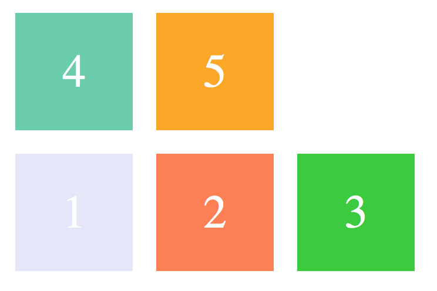

### 2.4. justify-content：定义了项目在主轴的对齐方式

```css
.container {
    justify-content: flex-start | flex-end | center | space-between | space-around;
}
```

注:建立在主轴为水平方向时测试，即 flex-direction: row

**默认值: flex-start 左对齐**

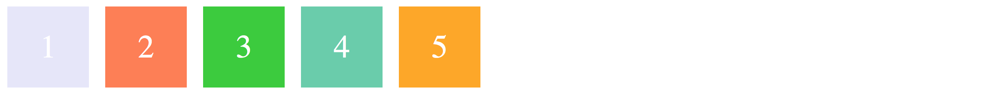

**flex-end：右对齐**

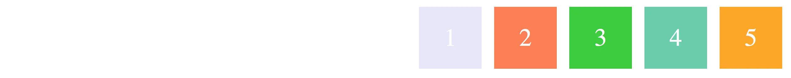

**center：居中**


**space-between：两端对齐，项目之间的间隔相等，即剩余空间等分成间隙。**

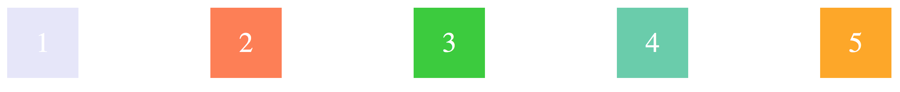

**space-around：每个项目两侧的间隔相等，所以项目之间的间隔比项目与边缘的间隔大一倍**

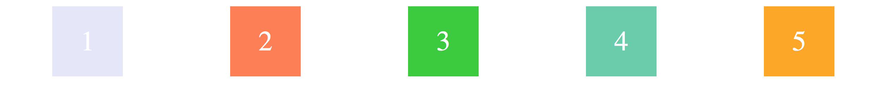

### 2.5. align-items: 定义了项目在交叉轴上的对齐方式

```css
.container {
    align-items: flex-start | flex-end | center | baseline | stretch;
}
```

注:建立在主轴为水平方向时测试，即 flex-direction: row。

默认值为 stretch 即如果项目未设置高度或者设为 auto，将**占满整个容器的高度。**

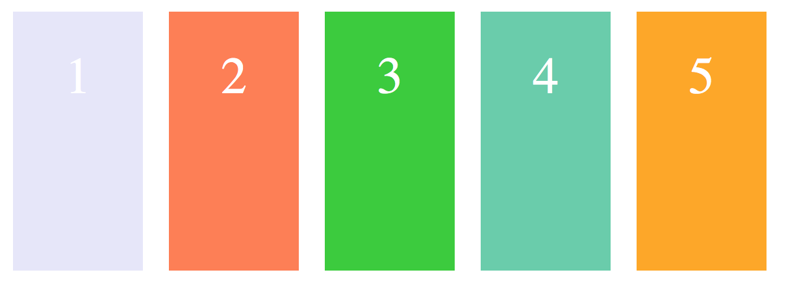

假设容器高度设置为 100px，而项目都没有设置高度的情况下，则项目的高度也为 100px。

**flex-start：交叉轴的起点对齐**

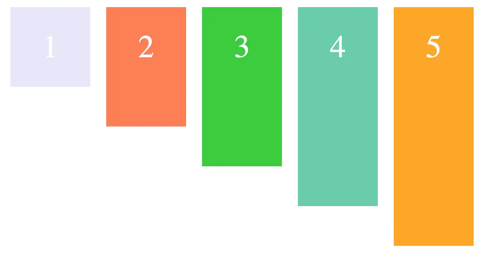

假设容器高度设置为 100px，而项目分别为 20px, 40px, 60px, 80px, 100px, 则如上图显示。

**flex-end：交叉轴的终点对齐**

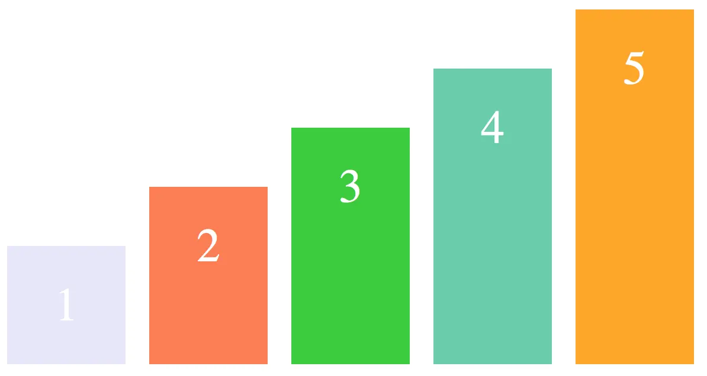

**center：交叉轴的中点对齐**

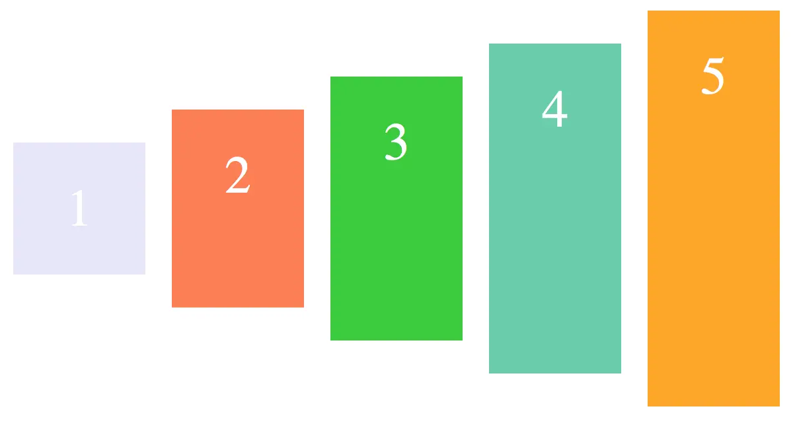

**baseline: 项目的第一行文字的基线对齐**

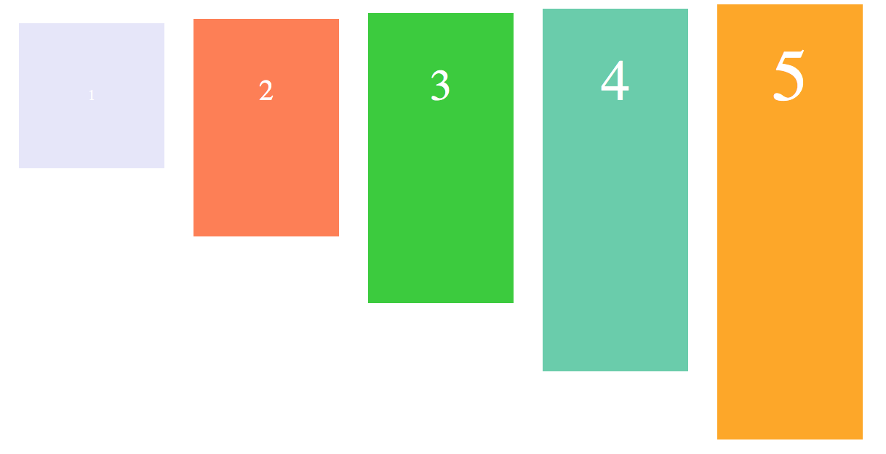

### 2.6.  align-content: 定义了多根轴线的对齐方式

**注:如果项目只有一根轴线，那么该属性将不起作用**

```css
.container {
    align-content: flex-start | flex-end | center | space-between | space-around | stretch;
}
```

这个这样理解：

当你 flex-wrap 设置为 nowrap 的时候，容器仅存在一根轴线，因为项目不会换行，就不会产生多条轴线。

当你 flex-wrap 设置为 wrap 的时候，容器可能会出现多条轴线，这时候你就需要去设置多条轴线之间的对齐方式了。

建立在主轴为水平方向时测试，即 flex-direction: row, flex-wrap: wrap

**默认值为 stretch**

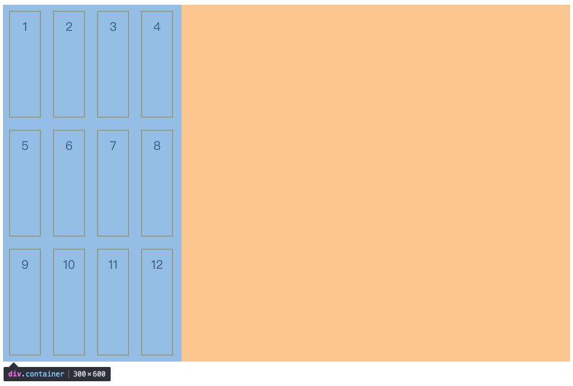

**flex-start：轴线全部在交叉轴上的起点对齐(左上角)**

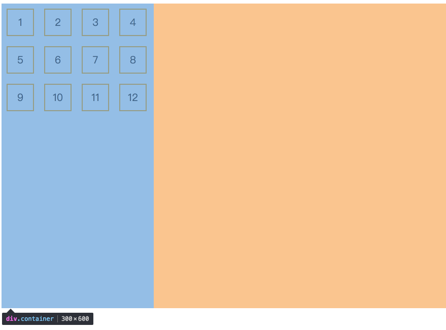

**flex-end：轴线全部在交叉轴上的终点对齐(右下角)**

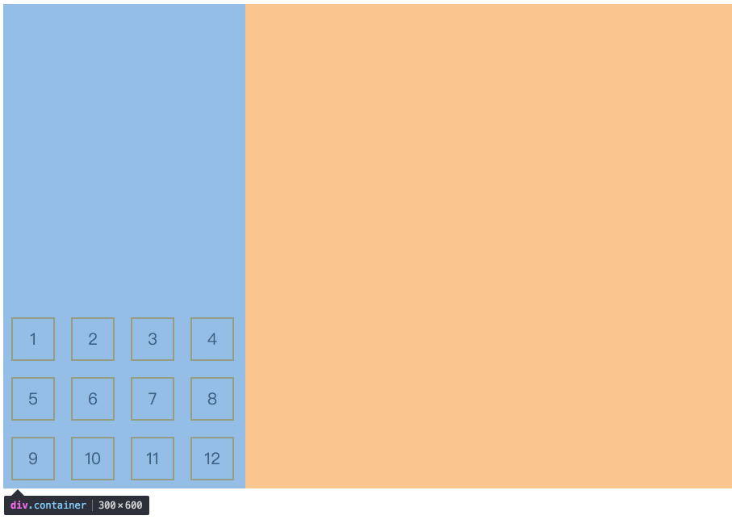

**center：轴线全部在交叉轴上的中间对齐**


**space-between：轴线两端对齐，之间的间隔相等，即剩余空间等分成间隙。(类比justify-content)**


**space-around：每个轴线两侧的间隔相等，所以轴线之间的间隔比轴线与边缘的间隔大一倍**

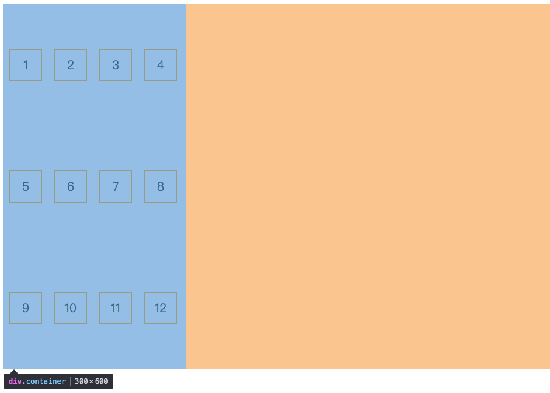

## 3. flex子项容器

### 3.1. order

**定义项目在容器中的排列顺序，数值越小，排列越靠前，默认值为 0**

```css
.item {
    order: <integer>;
}
```

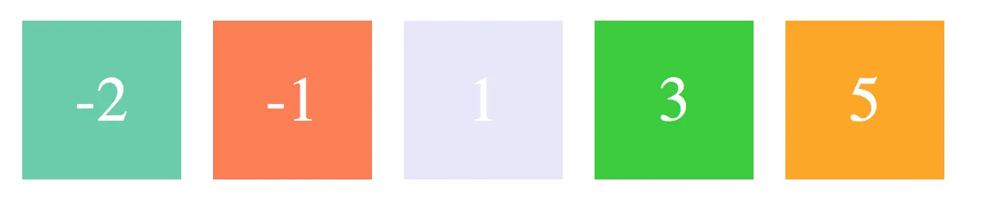

### 3.2. flex-basis

**定义了在分配多余空间之前，项目占据的主轴空间，浏览器根据这个属性，计算主轴是否有多余空间**

```css
.item {
    flex-basis: <length> | auto;
}
```

默认值：auto，即项目本来的大小, 这时候 item 的宽高取决于 width 或 height 的值。

**当主轴为水平方向的时候，当设置了 flex-basis，项目的宽度设置值会失效，flex-basis 需要跟 flex-grow 和 flex-shrink 配合使用才能发挥效果。**

- 当 flex-basis 值为 0 % 时，是把该项目视为零尺寸的，故即使声明该尺寸为 140px，也并没有什么用。
- 当 flex-basis 值为 auto 时，则跟根据尺寸的设定值(假如为 100px)，则这 100px 不会纳入剩余空间。

### 3.3.  flex-grow

**定义项目的放大比例**

```css
.item {
    flex-grow: <number>;
}
```

默认值为 0，即如果存在剩余空间，也不放大(依照basis)。

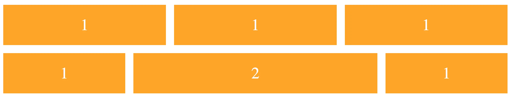

当所有的项目都以 flex-basis 的值进行排列后，仍有剩余空间，那么这时候 flex-grow 就会发挥作用了。

如果所有项目的 flex-grow 属性都为 1，则它们将等分剩余空间。(如果有的话)

如果一个项目的 flex-grow 属性为 2，其他项目都为 1，则前者占据的剩余空间将比其他项多一倍。

当然如果当所有项目以 flex-basis 的值排列完后发现空间不够了，且 flex-wrap：nowrap 时，此时 flex-grow 则不起作用了，这时候就需要接下来的这个属性。

### 3.4. flex-shrink

**定义了项目的缩小比例**

```css
.item {
    flex-shrink: <number>;
}
```

默认值: 1，即如果空间不足，该项目将缩小，负值对该属性无效。

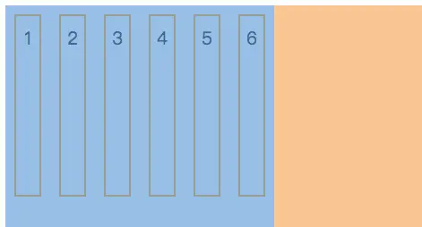

### 3.5. flex
**flex-grow, flex-shrink 和 flex-basis的简写**

```css
.item{
    flex: none | [ <'flex-grow'> <'flex-shrink'>? || <'flex-basis'> ]
} 
```

flex 的默认值是以上三个属性值的组合。假设以上三个属性同样取默认值，则 flex 的默认值是 0 1 auto。

有关快捷值：auto (1 1 auto) 和 none (0 0 auto)

当 flex 取值为一个非负数字，则该数字为 flex-grow 值，flex-shrink 取 1，flex-basis 取 0%，如下是等同的：

```css
.item {flex: 1;}
.item {
    flex-grow: 1;
    flex-shrink: 1;
    flex-basis: 0%;
}
```

当 flex 取值为 0 时，对应的三个值分别为 0 1 0%

```css
.item {flex: 0;}
.item {
    flex-grow: 0;
    flex-shrink: 1;
    flex-basis: 0%;
}
```

当 flex 取值为一个长度或百分比，则视为 flex-basis 值，flex-grow 取 1，flex-shrink 取 1，有如下等同情况（注意 0% 是一个百分比而不是一个非负数字）

```css
.item-1 {flex: 0%;}
.item-1 {
    flex-grow: 1;
    flex-shrink: 1;
    flex-basis: 0%;
}

.item-2 {flex: 24px;}
.item-2 {
    flex-grow: 1;
    flex-shrink: 1;
    flex-basis: 24px;
}
```

当 flex 取值为两个非负数字，则分别视为 flex-grow 和 flex-shrink 的值，flex-basis 取 0%，如下是等同的：

```css
.item {flex: 2 3;}
.item {
    flex-grow: 2;
    flex-shrink: 3;
    flex-basis: 0%;
}
```

当 flex 取值为一个非负数字和一个长度或百分比，则分别视为 flex-grow 和 flex-basis 的值，flex-shrink 取 1，如下是等同的：

```css
.item {flex: 11 32px;}
.item {
    flex-grow: 11;
    flex-shrink: 1;
    flex-basis: 32px;
}
```

